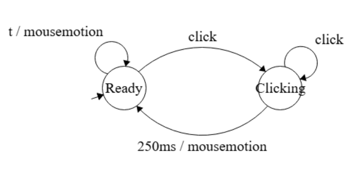

O programa utiliza uma FSM de dois estados: `READY` (aguarda o primeiro clique) e `CLICKING` (conta cliques dentro do tempo limite). Quando esse tempo expira, ele dispara um evento com o número de cliques acumulados (1, 2 ou 3).

* `1 clique` → o personagem se desloca horizontalmente até a posição do clique (*walking*);

* `2 cliques` → o personagem realiza um "salto" (*jumping*);

* `3 cliques` → o personagem executa a animação do golpe especial (*special*).

As mecânicas de *caminhar* e *saltar* precisam ser melhor elaboradas. A versão do código é bastante ingênua (velocidade constante, ausência de gravidade, valores arbitrários etc.).
