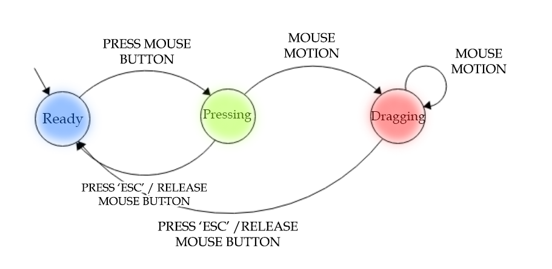

O programa abre uma janela com um retângulo posicionado no centro da tela que pode ser clicado ou arrastado, além de mudar de cor conforme a interação do usuário.
Ele utiliza uma FSM com os seguintes estados:

* `Ready (azul):` aguardando interação;

* `Pressing (verde):` retângulo pressionado. Se soltar vira clique, se mover vira arraste;

* `Dragging (vermelho):` retângulo segue o mouse até soltar (drop) ou cancelar com ESC.

O retângulo nunca sai da tela, e há mensagens de log indicando cada ação (Clicked, Dropped, Cancelled).
